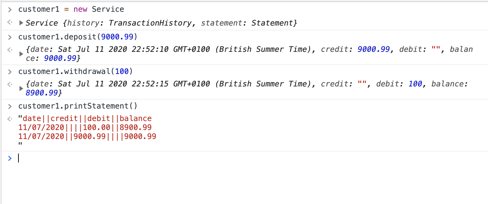

# Bank tech test

## Install instructions
- Fork repo
- Clone repo to local machine 
- Code is ready to use 

## Technology
- Language: Javascript 
- Testing Framework: Jasmine

## My Structure

I kept pretty close to my domain modelling in this project. I seperated them into classes rather than following a modular pattern as this didnt feel like a singleton object to me. 

Transaction Class: The action a user would interact with below in this class, it also keeps a record of these actions. 
Statement Class: This was abstarcted into its own class as the functiomity is different. Additonally I wanted tas the concerns of a 'transaction history' and a 'statement' are different I wanted to ensure they were kept seperate. 


## My Approach

- Using an 'console error guided' TDD approach. 

- I began by using the console in the SpecRunner.html to begin. This allows me to consider the MVP guided by user interaction.  

- After I address the console error as the first Jasmine test I need to write. For Example: ``` test_bank = Bank new ``` in the console returned Bank undefined.

- Used ESLint to ensure correct JS was used throughout 

- The code:

1. I began by making an overall class called Bank that would handle the transactions and the print bank statement methods. 
2. Then I refactored the transaction record and date format into 'private' methods. 
3. I renamed the bank class to transactions for clarity 
3. Then I created a bank statement class moving original the logic of printBankStament into this class 


## Dependancies
- The print statement class is dependant on the transaction class. The dependancies are one way as the I think logically there would be no use for a statement that was not linked to a set of transaction. Further, you may not want a statement for a set of transactions. 
 

## Images of the code running:



## Brief

### Requirements

- Deposits, withdrawal.
- Account statement (date, amount, balance) printing.
- Data can be kept in memory (it doesn't need to be stored to a database or anything).

### Acceptance criteria

Given a client makes a deposit of 1000 on 10-01-2012
And a deposit of 2000 on 13-01-2012
And a withdrawal of 500 on 14-01-2012

When she prints her bank statement
Then she would see

date || credit || debit || balance
14/01/2012 || || 500.00 || 2500.00
13/01/2012 || 2000.00 || || 3000.00
10/01/2012 || 1000.00 || || 1000.00


## Plan: 

### Input / Output 

Input | Output 
------|--------
deposit of 1000 on 10-01-2012 |
deposit of 2000 on 13-01-2012 | 
A withdrawal of 500 on 14-01-2012 |
|| Output:: 


date       || credit  || debit  || balance
14/01/2012 ||         || 500.00 || 2500.00
13/01/2012 || 2000.00 ||        || 3000.00
10/01/2012 || 1000.00 ||        || 1000.00


### Domain Model: 

Object | Message 
-------|---------
Bank:  |
|      | .constructor 
||          - this.balance = 0 
||          - this.credit = [[]]
||          - this.deposit = [[]]
|      | .desposit  (amount, date = Date.now())
|      | .withdrawal (amount, date = Date.now())
|      | .print()

- reconsidered the this.credit / desposit to be one constructor of:

Object | Message 
-------|---------
Bank:  |
|| constructor
|| - this.recordOfTransaction = {
    1: {date: 10.01.2012, credit: 1000.00, debit: "", balance: 1000 }
    2: {date: 13.01.2012, credit: 2000.00, debit: , balance: 3000 }
    3: {date: 14.01.2012, credit: "", debit: 500.00, balance: 2500.00}
}

Rename Bank to transaction 

Object | Message 
-------|---------
Statement:  | 
||.printBankStatement


### User Stories

AS A bank customer,
SO THAT to track of my money 
I NEED to have a bank balance √

AS A bank customer, 
SO THAT I can store
I NEED to be able to despoit cash √

AS A bank customer, 
SO THAT I can use my money
I NEED to be able to withdraw my cash √

AS A tax auditor 
SO THAT I can track peoples finances 
I NEED to have an accurate record of a bank customers despoits √

AS A tax auditor 
SO THAT I can track peoples finances 
I NEED to have an accurate record of a bank customers withdrawals √ 

AS A bank customer, 
SO THAT I can track my finances 
I NEED to have a statement printed √

AS A bank customer,
SO THAT I do not overdraw my account
I NEED to only withdraw funds I have

## Extra Requirements:
- Someone tries to withdraw money they do not have 
- someone prints a statement without activity 
- doesnt give exact pounds i.e. decimal


## Want to contribute?! 
- Fork this repo
- Clone to machine 
- Submit a pull request 


